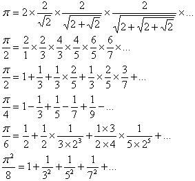
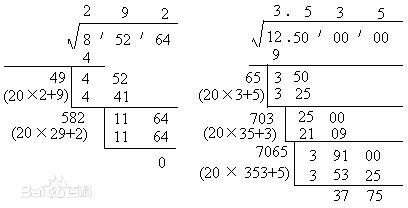
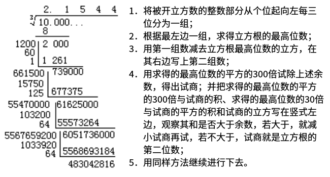

# utils
杂项源码
  * cpu-memory-info.c => Unix系统下的CPU和内存信息的实时监控.
  * nonRepetitiveSequence.c => 不重复序列的生成.
  * download.php => 响应浏览器另存为文件（下载），支持大文件下载，支持断点续传
  * linux-server-info.php => Web版本的Unix服务器的实时监控.
  * proxy.php => php版本的反射代理
  * hongbao.php => 红包算法
  * str_split_unique.sql => MySQL版本的基于分隔符的子字符串唯一处理的函数
  * MQ => IBM MQSeries(IBM公司的消息队列服务)相关测试代码
    * java => Java版本的eclipse项目代码
    * get.php => PHP版本的读取消息
    * put.php => PHP版本的写入消息
    * test.sh => 创建队列并启动相关服务的Shell脚本(必须在mqm用户下执行: Linux系统下测试通过)
  * base64.c => base64加密与解密
  * getcmdopt.c => 获取指定格式的命令行参数(参数识别/粘贴)
  * md5.c => md5哈希值
  * crypt.c 康盛公司UCenter中的加解密算法
  * crypt.php 康盛公司UCenter中的加解密算法
  * conn-stat.sh 统计TCP监听端口的连接数
  * qrcode-transfer-file 二维码传输文件
  * gif2png.py => 把GIF图片中的每一帧保存为PNG图片
  * mat2jpg.py => 把caffe的预测图mat文件转为jpg格式
  * listen.sh => linux获取本地TCP监听端口号
  * url.c => URL格式分析，来自php7中的同名文件，做了删减
  * 9x9.c => 加法、减法、乘法和除法表
  * 3Angle.c => 字符打印之等腰三角形
  * YangHuiTriangle.c => 杨辉三角形
  * YangHuiTriangle2.c => 杨辉三角形(空间复杂度O(n))
  * BubbleSort.c => 冒泡排序
  * 5AngleStar.c => 字符打印之五角星
  * cpuid.c => 获取CPU序列号
  * svnignore.php => 忽略所有SVN无版本控制文件
  * mac.c => 所有网络MAC列表
  * greatestCommonDivisor.c => 最大公约数(辗转相除法)
  * BatteryScale => Android充电模式动画
  * rftp.sh => 根据本地目录递归(find和awk命令)生成ftp操作(ftp命令)的shell脚本
  * rftp.php => 递归ftp上传、下载和删除目录的php脚本(控制台版)
  * rftp.py => 递归ftp上传、下载和删除目录的python脚本(控制台版)
  * ftp.c => ftp之C语言库
  * rftp.c => 递归ftp上传、下载和删除目录的C程序(控制台版)
  * PI.c => 简单圆周率算法
  * PI1000.c => 高精圆周率算法
  * time.c => 时间格式化
  * hanoi.c => 河内塔算法
  * algo-mul.c => 大数乘法
  * algo-div.c => 大数除法(包括余数和小数两种功能)
  * algo-dec2bin.c => 大数十进制转二进制
  * algo-dec2oct.c => 大数十进制转八进制
  * algo-dec2hex.c => 大数十进制转十六进制
  * algo-base-convert.c => 大数n进制转n进制(n大于等于2且小于等于36)
  * algo-four-rules-of-arithmetic.c => 四则运算(AST语法规则: 正、负、加、减、乘、除和括号)
  * algo-sqrt.c => 大数开平方算法
  * algo-cbrt.c => 大数开立方算法
  * narcissistic-number.c => 水仙花数
  * prime-factor.c => 正整数分解质因数
  * dirs-mysql.c => 基于C语言实现的mysql数据库目录或文件递归索引
  * dirs-sqlite3.c => 基于C语言实现的sqlite3数据库目录或文件递归索引
  * dirs.c => 基于C语言实现的结构体目录或文件递归索引
  * rows-sqlite3.php => 列出sqlite3所有表的总记录数
  * human.php => 使用对数函数计算并格式化友好文件大小
  * diff.sh => 比较两个目录并显示不同的文件
  * re.c => POSIX正则表达式验证邮件地址
  * xiaotou.c => 小偷偷窃算法
  * msg.c => 消息队列(msgget,msgsnd,msgrcv,msgctl)
  * sem.c => 私有信号量(sem_init,sem_wait,sem_post,pthread_create,pthread_mutex_*)
  * mmap-mutex.c => 进程间互斥量(mmap,fork,pthread_mutex)
  * fork.c => 新进程与线程的关系(fork,pthread_create)
  * dup.c => dup、dup2和fcntl(fp,F_DUPFD,...)函数的使用
  * exec.c => execl、execlp、execle、execv、execvp和execvpe三个函数的使用，这些函数执行成功后以指定命令进行数据段、代码段、堆和栈等的替换，exec函数之后的代码不会执行
  * fork2.c => pipe/socketpair、select、dup2和execlp综合实验，可对要执行命令的stdin,stdout和stdout进行多路复用方式的读写操作

## 图片

